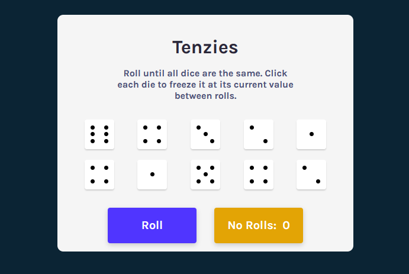

# Tenzies

Tenzies is a simple dice rolling game where the objective is to have all the dice showing the same number.

This project was coded as part of FreeCodeCamp's Into to React course. It is the final instructor led project.

As extra credit work on top of the instructor led piece I have added a counter to track the number of rolls used to complete the game and modified the dice to indicate their value with pips instead of a number.

I am hosting the completed game on [Vercel](https://tenzies-omega.vercel.app/)

## Built With
[React.js](https://reactjs.org/)
[react-dom-confetti](https://www.npmjs.com/package/react-dom-confetti)

## What I learned
Although I had already used most of the skills needed to complete this project in example cases this was the first time I had used many of them to complete a full project.

* useEffect
* .map and the spread operator inside useState
* Passing different function as the same prop via a ternary operator
* Using the switch statement to dynamically control the structure of a component